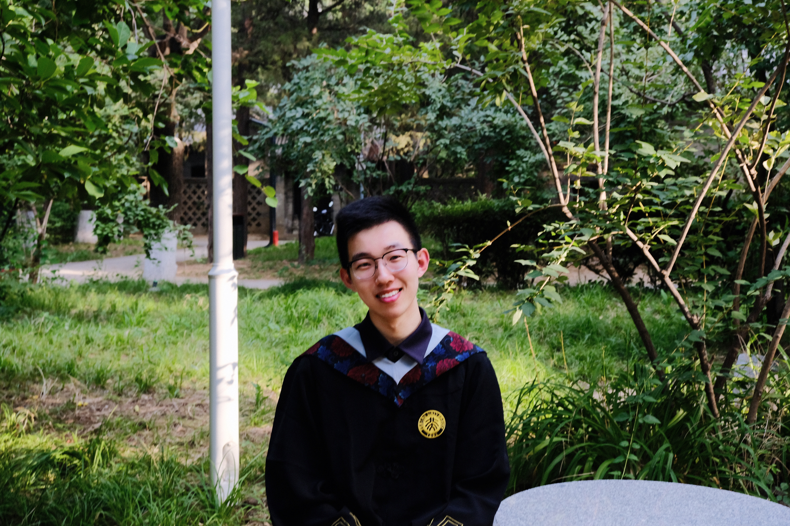

# Tianyu Wen (文 天宇)

### Always towards 🏳️‍🌈rainbow and red pandas.

## Bio
I am a former Graph Learning researcher from DS[@PKU](https://english.pku.edu.cn/) and now a career seeker at ECE[@UIUC](https://ece.illinois.edu/). I would like to utilize my experience of academic research into industry scenarios.

I am expert in Python and C++ programming with machine learning technics including PyTorch and PyG. I also enjoys learning mathematics behind AI algorithms and intends to expand my horizens towards different application fields including Computer Vision and Data Mining.

## Interest

I was born in Xinxiang, Henan, China and spent the first 18 years of my life there. My all-time beloved is [red panda](https://en.wikipedia.org/wiki/Red_panda), adorable angels on the planet and becoming even more popular after the movie *[Turning Red](https://en.wikipedia.org/wiki/Turning_Red)* on.

Music is part of my life and [Lala Hsu](https://en.wikipedia.org/wiki/Lala_Hsu) is my favourite singer. I also enjoys American Pop and recently I became a vinyl collector.
Also, I am a forever badminton rookie and a broken writer.

## Education
\- Sep. 2016 - Jul. 2019\
Xinxiang, Henan, China\
Affiliated Middle School of Henan Normal University

\- Sep. 2019 - Jul. 2023\
Beijing, China\
**Peking University** @PKU\
Yuanpei College\
Bachelor of Science in Data Science

\- Aug. 2023 - Dec. 2024 (Expected)\
Urbana, Illinois, United States\
**University of Illinois Urbana-Champaign** @UIUC\
Department of Electrical and Computer Engineering\
Grainger College of Engineering\
Master of Engineering in Electrical and Computer Engineering

## Work Experience
\- [!*Upcoming*] May. 2023 - Aug. 2023\
San Jose, California, United States\
**WeRide Corp** [@WeRide.ai](https://www.weride.ai/)\
Perception Team\
Software Engineer Intern

\- Jun. 2022 - Feb. 2023\
Beijing, China\
**Alibaba (Beijing) Software Services Co., Ltd.** [@Alibaba](https://www.alibabagroup.com/en-US/)\
Alimama Advertising Technology Department\
Algorithm Engineer Intern

\- Sep. 2020 - Jan. 2023\
Beijing, China\
**Machine Intelligence and Perception Laboratory** @PKU\
School of Intelligence Science and Technology, Peking University\
Undergraduate Research Assistant\
Mentor: [Guojie Song](https://scholar.google.com.hk/citations?user=a832IIMAAAAJ&hl=en)

## Research
\- [On Structural Expressive Power of Graph Transformers](https://dl.acm.org/doi/10.1145/3580305.3599451) [[PDF](https://dl.acm.org/doi/pdf/10.1145/3580305.3599451)]\
As the 2nd author led by [Wenhao Zhu](https://scholar.google.com/citations?hl=en&user=ImQQVygAAAAJ)\
In Proceedings of **the 29th ACM SIGKDD Conference on Knowledge Discovery and Data Mining** @KDD23’

\- [Hierarchical Transformer for Scalable Graph Learning](https://www.ijcai.org/proceedings/2023/523) [[PDF](https://www.ijcai.org/proceedings/2023/0523.pdf)]\
As the 2nd author led by Wenhao Zhu\
In Proceedings of **the 32nd International Joint Conference on Artificial Intelligence** @IJCAI23’

\- [Equivalent Distance Geometry Error for Molecular Conformation Comparison](https://arxiv.org/abs/2201.08714) [[PDF](https://arxiv.org/pdf/2201.08714.pdf)]\
As the 2nd author led by [Shuwen Yang](https://scholar.google.com/citations?hl=en&user=mGpZECcAAAAJ)\
Arxiv Pre-printed