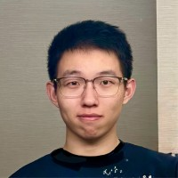

# Tianyu Wen (文 天宇)

<!-- ### Always towards 🏳️‍🌈rainbow and red pandas. -->

## [💼 CV](./cv.md) | [📋 Blog](./blog/blogs.md) | [🚢 Travel](./Travel/travel.md)

## 🔗 Profile

[LinkedIn](https://www.linkedin.com/in/tianyu-wen-54512b273/) | [GitHub](https://github.com/Wen-Tianyu) | [Google Scholar](https://scholar.google.com/citations?user=UCRUPCEAAAAJ&hl=en)

## 📚 Study
I am a former Graph Learning researcher from DS[@PKU](https://english.pku.edu.cn/) and ECE[@UIUC](https://ece.illinois.edu/). Now I am working as a full-time Machine Learning Enginner at [@](https://www.tiktok.com/about?lang=en)[Tik](https://www.tiktok.com/about?lang=en)[Tok](https://www.tiktok.com/about?lang=en).

I am expert in Python and C++ programming with machine learning technics including PyTorch and TensorFlow. I also enjoys learning mathematics behind AI algorithms and intends to expand my horizens towards different application fields including Computer Vision and Data Mining.

## 🎨 Interest

I was born in Xinxiang, Henan, China and spent the first 18 years of my life there. My all-time beloved is [red panda](https://en.wikipedia.org/wiki/Red_panda), adorable angels on the planet and becoming even more popular after the movie *[Turning Red](https://en.wikipedia.org/wiki/Turning_Red)* on.

Music is part of my life and [Lala Hsu](https://en.wikipedia.org/wiki/Lala_Hsu) is my favourite singer. I also enjoys American Pop and recently I became a vinyl collector.
Also, I am a forever badminton rookie and a broken writer.