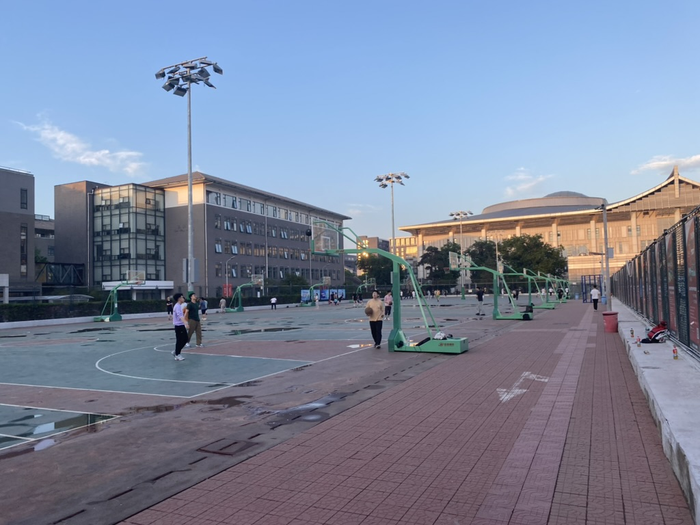

# Beijing 北京

🩵 *这里是我除家乡外迄今为止停留时间最长的城市，也保存着我在本科四年所有珍贵的回忆。感谢赖弘越、赖勋豪、李翔和我的三位室友陪伴，以及很多不在此继续一一列举的朋友们。我永远相信，我们一定会再次相遇。同时感谢我在这里的各位家人们，为我提供了很多真实的帮助。*

## ⭐ Shots for Peking University 北京大学

\
↗️ 每个人相册里都会存着的一张包含未名湖和博雅塔的照片

\
↗️ 未名湖上的野鸭和鸳鸯们在向岸边聚拢

\
↗️ 夏天的35号楼门前，这里是元培学院的宿舍楼，也是我本科四年生活的地方，感谢地下室的自习室、台球室、研讨室和电影室，从这里到学一食堂、家园食堂和29号楼地下的全家便利店也很方便

\
↗️ 冬天的35号楼门前，被雪覆盖的也有我的自行车，其在我离校时以几十元的价格被转卖

\
↗️ 春天的静园，我曾经在这里参加过定向与徒步运动课程，也围观过学校Taylor Swift粉丝群的歌会

\
↗️ 五四体育场北面的篮球场，穿过这里到东面的邱德拔体育馆游泳的路我走过很多遍

\
↗️ 2024年五四青春长跑活动时的五四体育场，远处是笔直的王克桢楼

\
↗️ 从第三教学楼的顶层俯瞰五四体育场的景色，这里的窗边非常适合自习

\
↗️ 第一体育馆北侧山鹰社岩壁旁静静伫立的玛尼堆，用以纪念在山难中不幸离世的社员，附近是定向与徒步运动课程的集合地点

\
↗️ 某天在南门外拍到的有些混乱的天空，这里是我进出学校通过最多的地方，从这里出门步行到中关村地铁站乘坐地铁4号线也是我最习惯的出行方式，其次是从这里或西南门出门乘坐公交出行，抑或是从这里直接步行到苏州街或新中关的餐厅

\
↗️ 北京大学流浪猫关爱协会是我在本科唯一加入过的学生社团，定期喂猫也要让我认识了很多新朋友，图为在校园北侧居民区附近出没的墨可

\
↗️ 第一体育馆的屋檐

\
↗️ 我在清华大学开放互选的手工制作创新实践课程中和团队一起制作的微花园项目

\
↗️ 我从元培学院毕业的时刻

\
↗️ 我从北京大学毕业的时刻

\
↗️ 我从北京大学离开的时刻

## Shots

\
↗️ 在冬天河面已经结冰的什刹海

\
↗️ 2023年夏天的某次从西苑到国贸的夜骑途中经过的天安门广场

\
↗️ 天坛公园的祈年殿

\
↗️ 从北京西山国家森林公园的半山腰向市区方向望去的白天的景色

\
↗️ 从北京西山国家森林公园的半山腰向北郊方向望去的夜晚的景色，远处的道路如同巨龙般蜿蜒闪烁着

 \
↗️ 玉渊潭公园的八一湖岸，远处是中央广播电视塔，这里很适合春游踏访

## Reminder
📍 [**文昌桥螺蛳粉**] 北京市海淀区韦伯时代大厦C座B1层九洲风味美食街\
这里有我迄今为止吃到过的最好吃的螺蛳粉，配合炸蛋和烫青菜可以获得超高的评价

📍 [**天下晓富酸辣粉**] 北京市西城区横二条西单明珠商场对面\
非常地道的重庆酸辣粉，即便不放辣椒也能让人欲罢不能，店内的铁板烧也非常正宗，总体而言是一家必吃的宝藏餐厅

### [🚢 Travel](./travel.md)