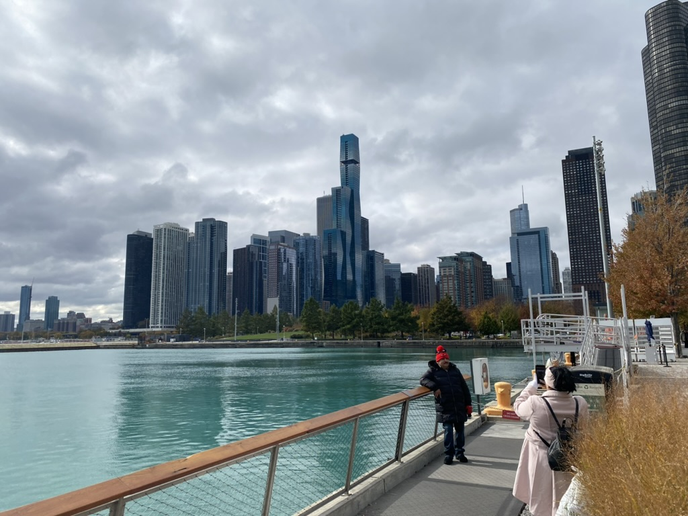
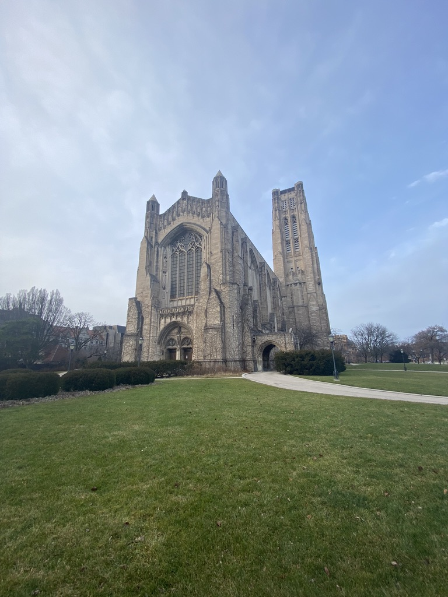
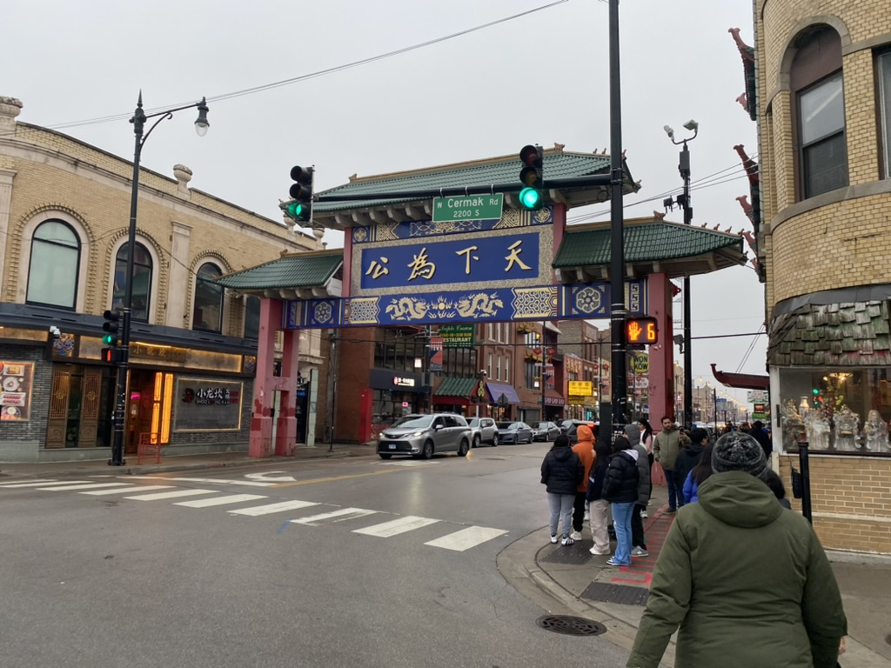

# Chicago

🩵 *Special thanks to Dongqi Guo and Yixuan Wang for once sharing rooms during my visit and they are both great alumni of Peking University. Also delighted to meet Changyu Yao, another PKUer from St. Louis!*

## Shots

\
↗️ Chicago downtown seen from Navy Pier

\
↗️ Along Lake Michigan

\
↗️ The Rockefeller Memorial Chapel in University of Chicago

\
↗️ Macy's decoration during 2023 Christmas

\
↗️ Christmas market 2023 in Chicago

\
↗️ Chicago River around the Loop with shining buildings

\
↗️ Georges Seurat's *A Sunday Afternoon on the Island of La Grande Jatte* in the Art institute of Chicago

\
↗️ Gateway through Chicago Chinatown

## Reminder
📍 [**MingHin Cuisine (名轩)**] 2168 S Archer Ave, Chicago, IL 60616\
placeholder

### [🚢 Travel](./travel.md)
