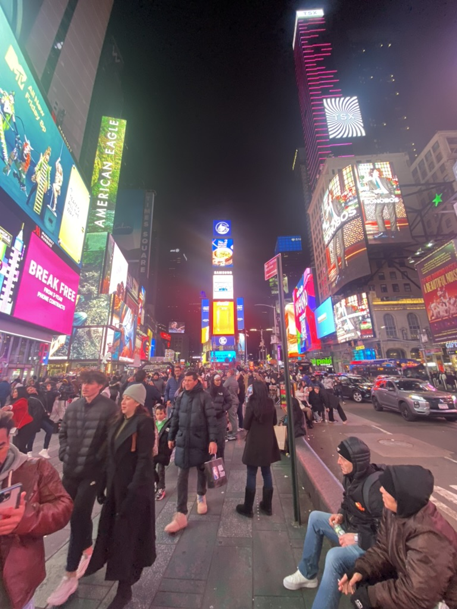
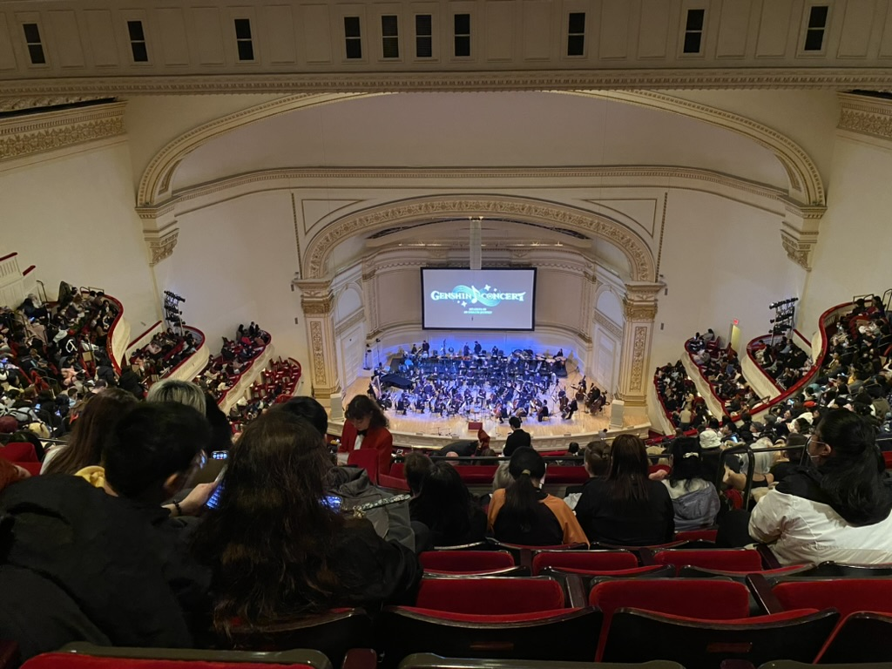
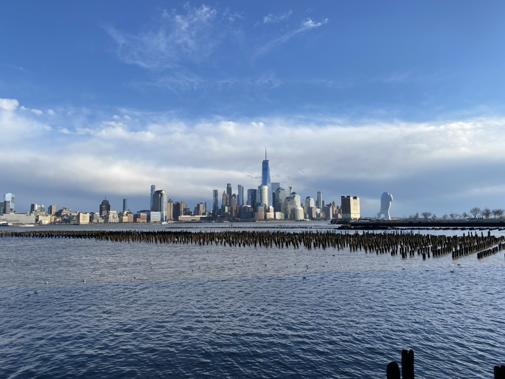

# New York City

🩵 *Special thanks to Xiang Li, one of my best friends at Peking University and studying at New York University, for sharing his room during my visit.*

## Shots

\
↗️ Time Square is always crowded, even at midnight

\
↗️ *Genshin Concert 2024: Melodies of an Endless Journey* at Carnegie Hall in New York City

\
↗️ Looking toward Downtown Manhattan from New Jersey

\
↗️ The Brooklyn Bridge at night in NYC

## Reminder
📍 [**Cho Dang Gol**] 55 W 35th St. New York, NY 10001\
Here serving wonderful Korean cuisines including homemade makgeolli with refreshing pears as my top recommendation. 

### [🚢 Travel](./travel.md)