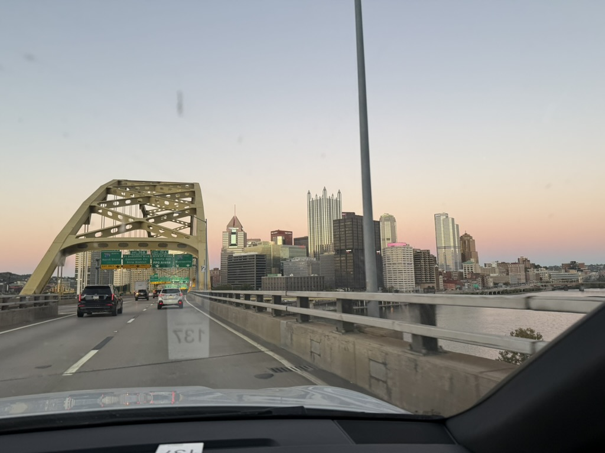
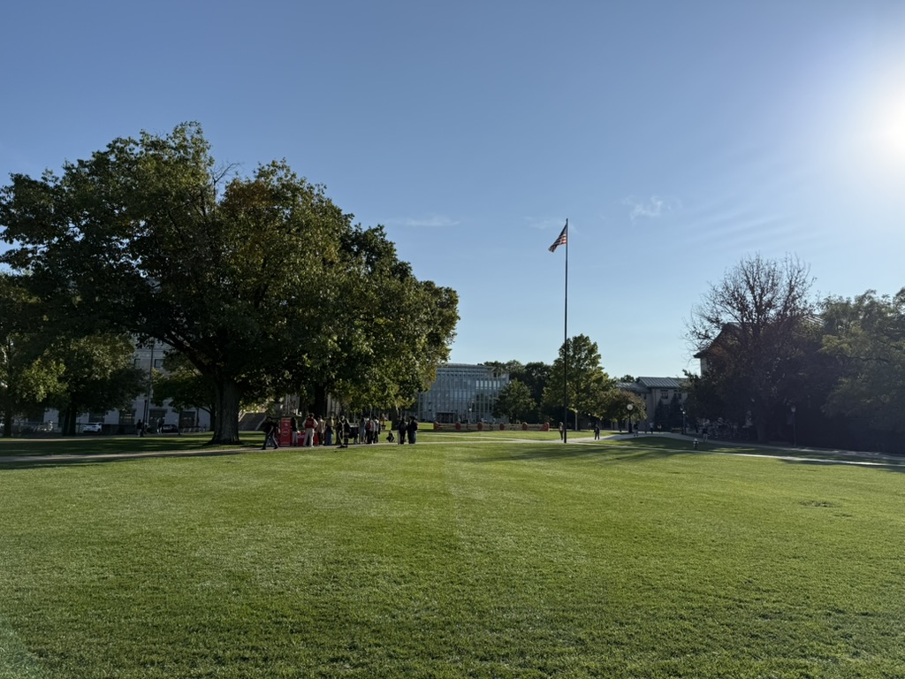
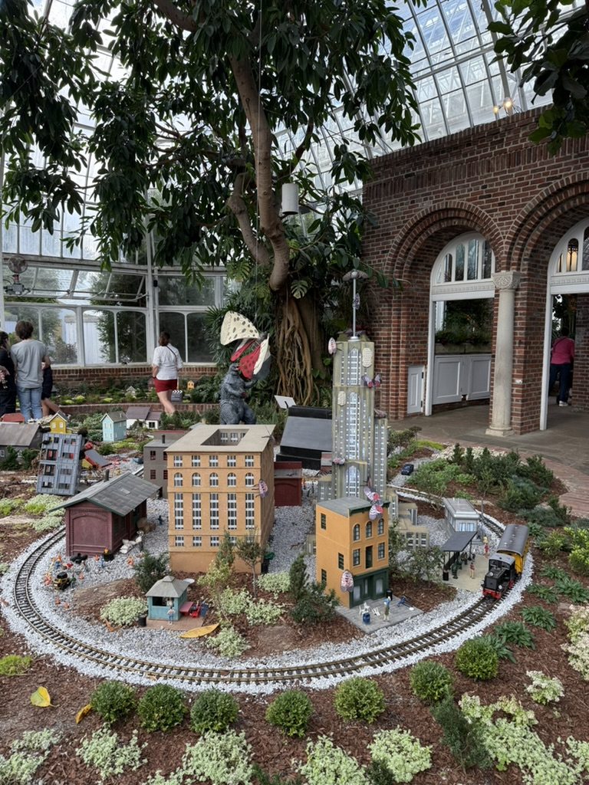
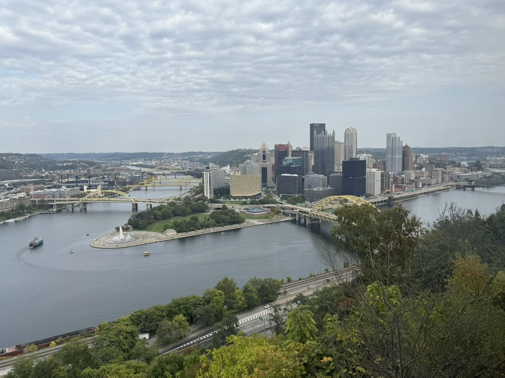

# Pittsburgh

🩵 *Special thanks to Chenwei Lyu, one of my best friends at WeRide and studying at Carnegie Mellon University, for sharing his room during my visit. Feel lucky to reuinon with Lingran Zhao, Ziyou Ren, Guanglei Zhu, Qiaoying Xu, Jiaheng Han, Hsuan Lee, Qin Han, Yixin Fei since our last meeting at San Jose. Also so delighted to meet Haoran Zhang, my high school classmate after years!*

## Shots

\
↗️ The first look at the city breathtaking after through the tunnel!

\
↗️ “The Fence" at Carnegie Mellon University with frequent changes almost every day

\
↗️ The city model placed in Phipps Conservatory and Botanical Gardens with lanternflies, which is a nightmare of the city

\
↗️ Wonderful view from the top of Duquesne Incline

### [🚢 Travel](./travel.md)