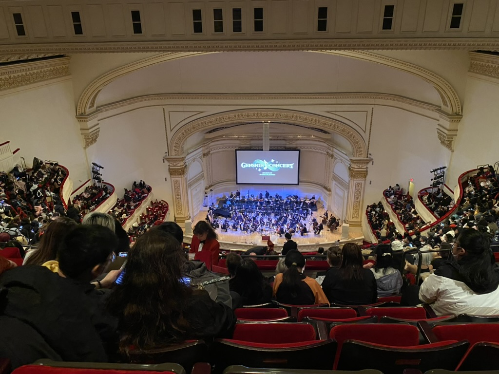
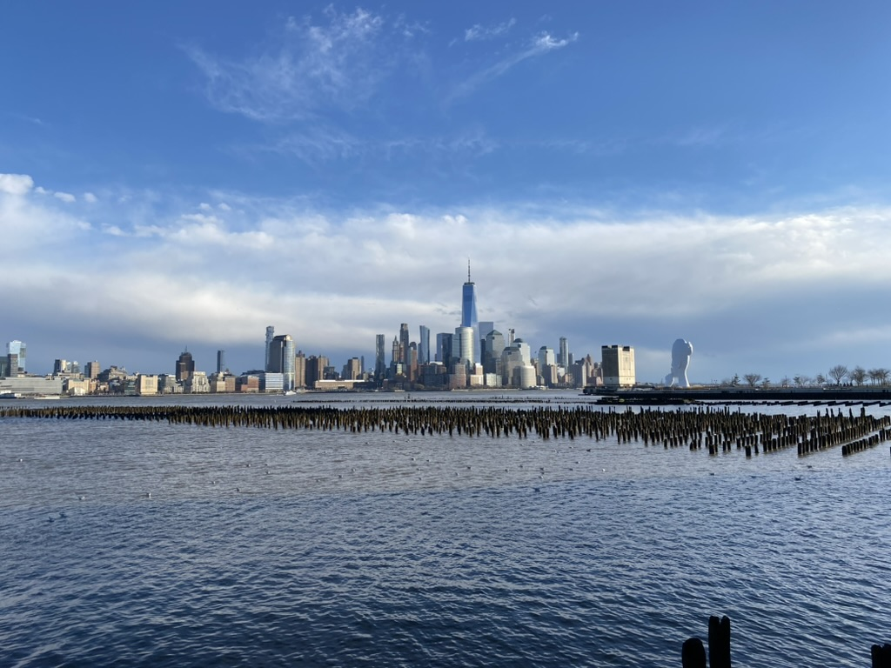
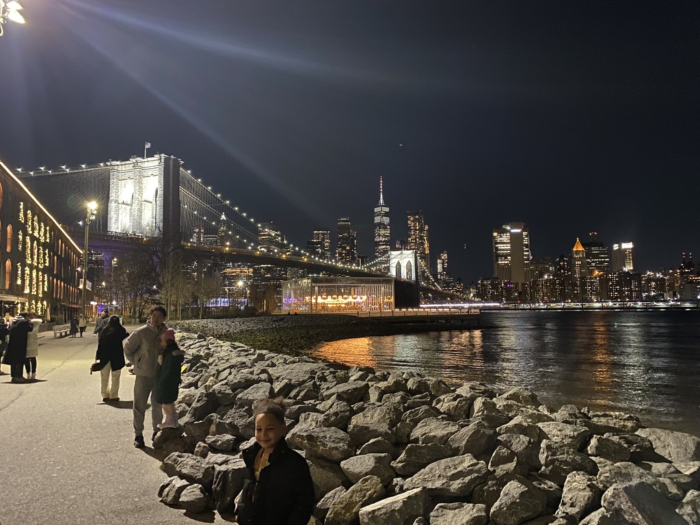

# Pittsburgh

🩵 *Special thanks to Chenwei Lyu, one of my best friends at WeRide and studying at Carnegie Mellon University, for sharing his room during my visit. Feel lucky to reuinon with Lingran Zhao, Ziyou Ren, Guanglei Zhu, Qiaoying Xu, Jiaheng Han, Hsuan Lee, Qin Han, Yixin Fei after our last meeting at San Jose. Also so delighted to have dinner with Haoran Zhang, my high school classmate after years!*

## Shots

\
↗️ Time Square is always crowded, even at midnight

\
↗️ *Genshin Concert 2024: Melodies of an Endless Journey* at Carnegie Hall in New York City

\
↗️ Looking toward Downtown Manhattan from New Jersey

\
↗️ The Brooklyn Bridge at night in NYC

## Reminder
📍 [**Cho Dang Gol**] 55 W 35th St., New York, NY 10001\
Here serving wonderful Korean cuisines including homemade makgeolli with refreshing pears as my top recommendation. 

### [🚢 Travel](./travel.md)