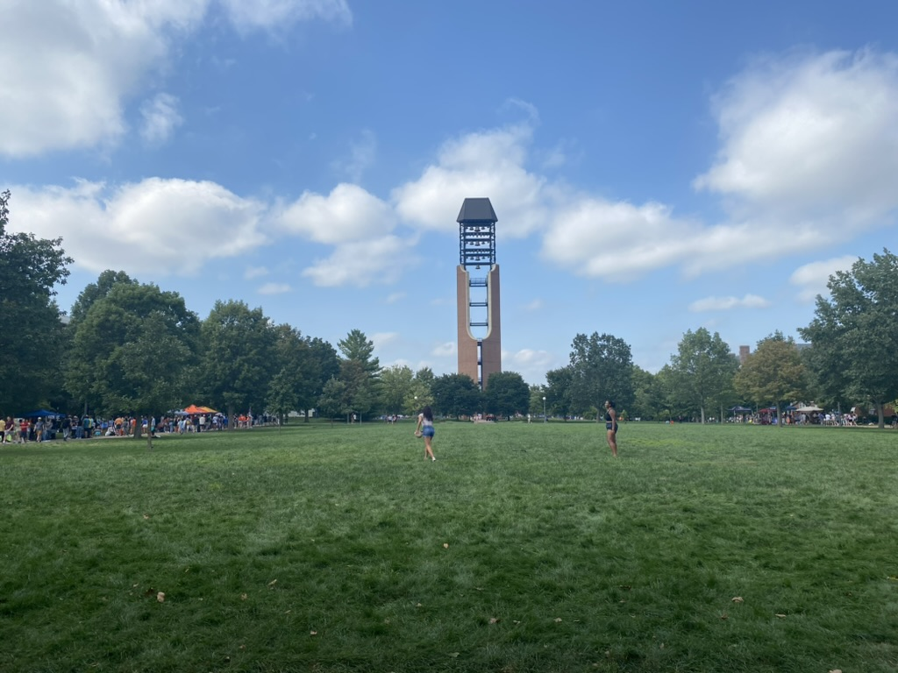
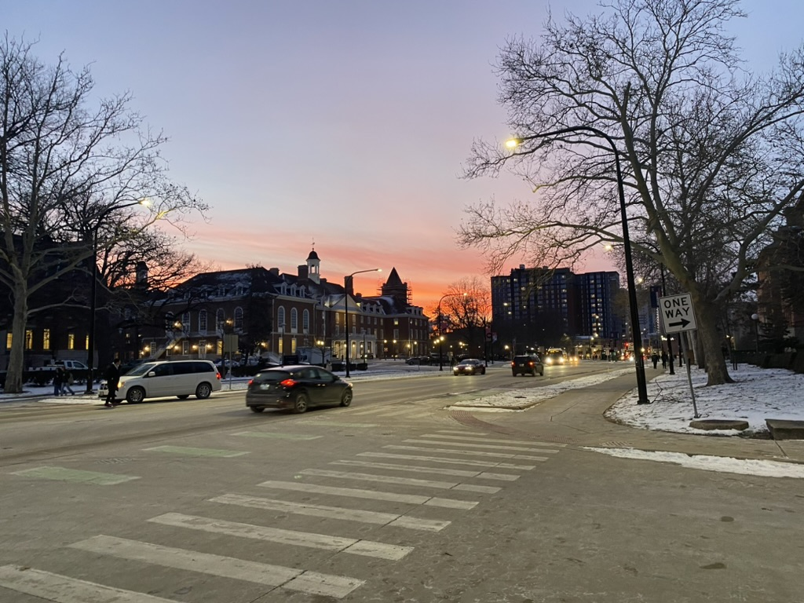

# Urbana-Champaign

🩵 *Special thanks to all the PKUers, THUers, ZJUIers and UIUCers I met in here for accompanying me in this wonderful journey of graduate study. Including but not limited to Yihong Jin, Yuhao Ge, Xiyan Xu, Xin Xu, Muyan Hu, Hao Guo, Shangzhen Zhu, Bing Wang, Yifei Song, Congshan Yu, Taoran Li, Haozhe Chen, Mark Bauer, etc.*

## Shots

\
↗️ Main Quad of UIUC, almost visually identical to Tsinghua University's

\
↗️ UIUC's autumn

\
↗️ The McFarland Memorial Bell Tower in UIUC

\
↗️ There are always snowy days in Urbana-Champaign's winter

\
↗️ Looking from the window of the Grainger Engineering Library

\
↗️ Do not miss the sky at dusk

### [🚢 Travel](./travel.md)