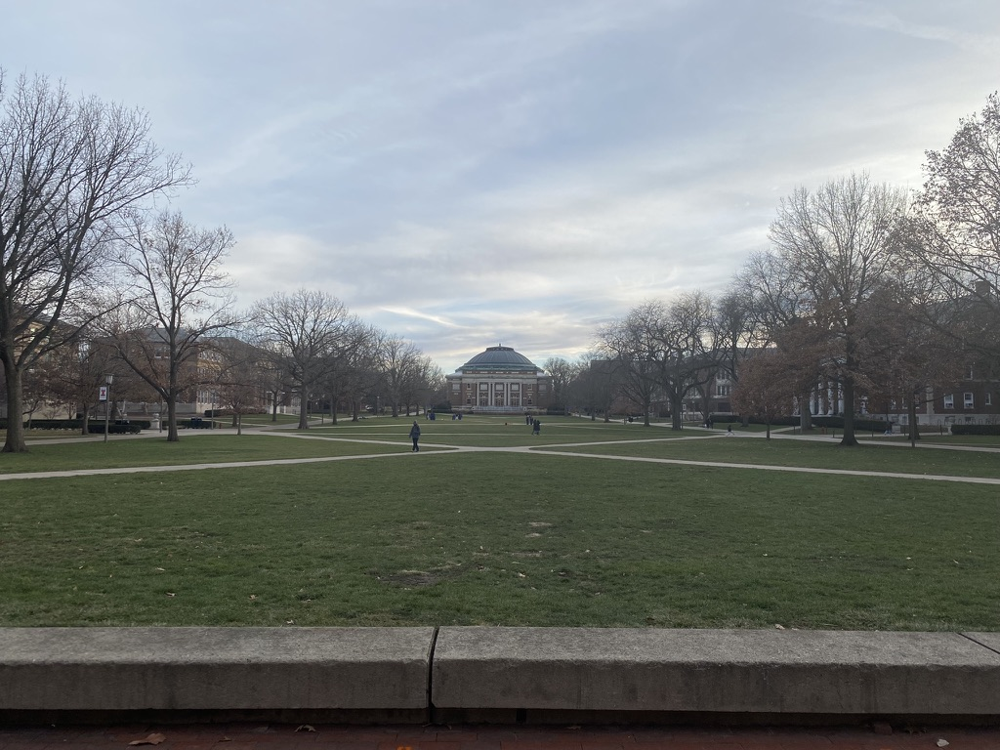
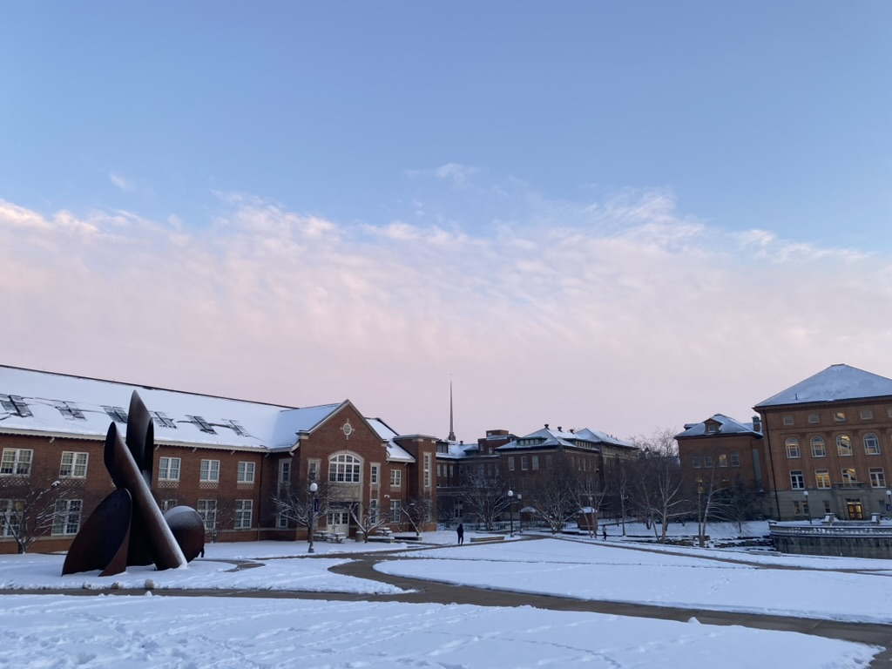
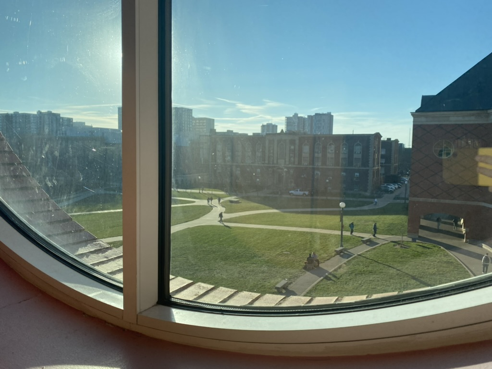

# Urbana-Champaign

🩵 *Special thanks to all the PKUers, THUers, ZJUIers and UIUCers I met here for accompanying me in this wonderful journey of graduate study. Including but not limited to Yihong Jin, Yuhao Ge, Xiyan Xu, Xin Xu, Jiangwei Yu, Muyan Hu, Hao Guo, Shangzhen Zhu, Bing Wang, Yifei Song, Congshan Yu, Taoran Li, Haozhe Chen, Mark Bauer, etc.*

## Shots

\
↗️ Main Quad of UIUC, almost visually identical to Tsinghua University's

\
↗️ UIUC's autumn

\
↗️ The McFarland Memorial Bell Tower in UIUC

\
↗️ There are always snowy days in Urbana-Champaign's winter

\
↗️ Looking from the window of the Grainger Engineering Library

\
↗️ Do not miss the sky at dusk

## Reminder
📍 [**Black Dog Smoke & Ale House**] 320 N Chestnut St, Champaign, IL 61820\
The beef brisket and burnt ends here is amazing and I need to visit here every few weeks to satisfy my stomach. Mac and cheese and fries are also appetizing! 

📍 [**Sakanaya**] 403 E Green St, Champaign, IL 61820\
An amazing Japanese restaurant and the sashimi there has great quality with favorable price. The donkatsu and sushi are also tasty, and this is where I fell in love with Japanese cuisine again.

### [🚢 Travel](./travel.md)