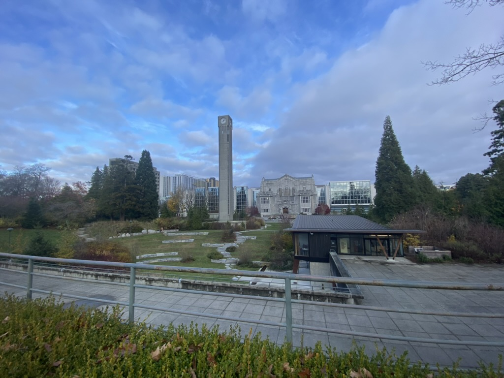
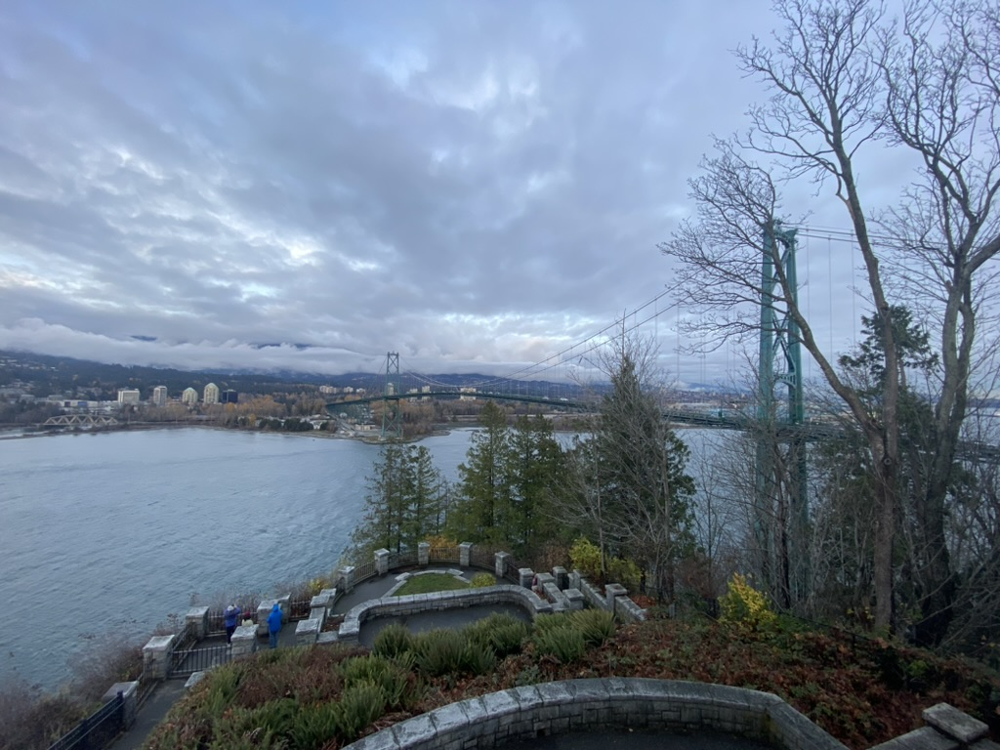
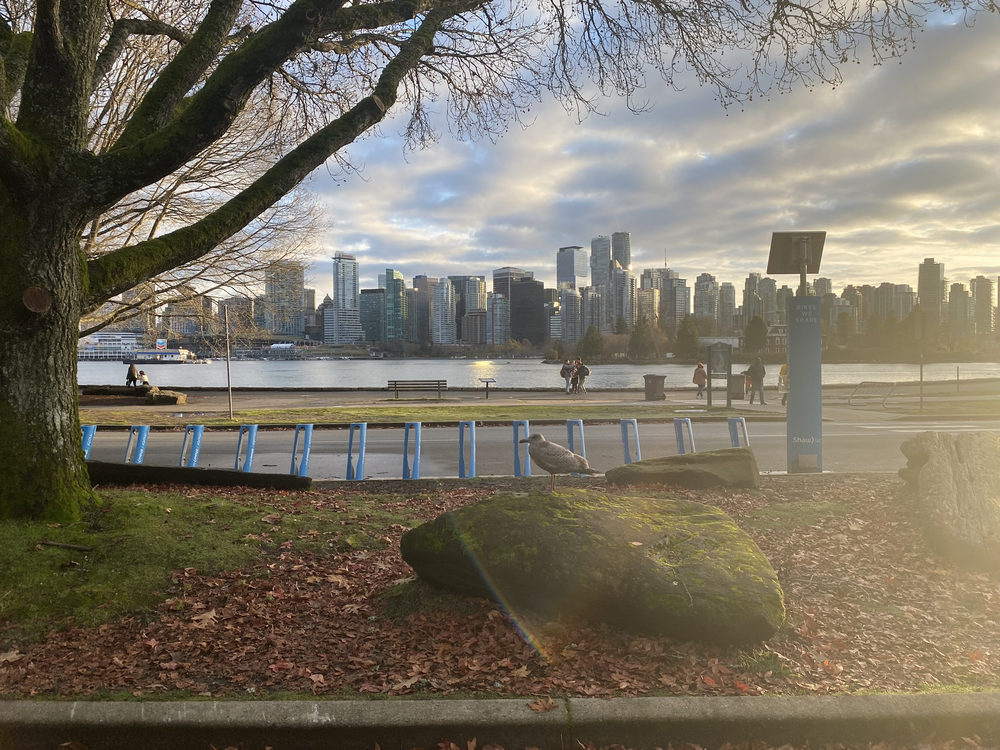
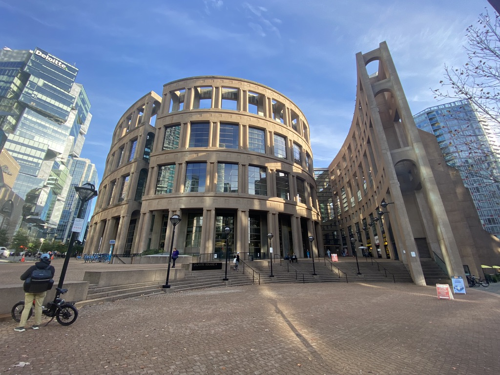
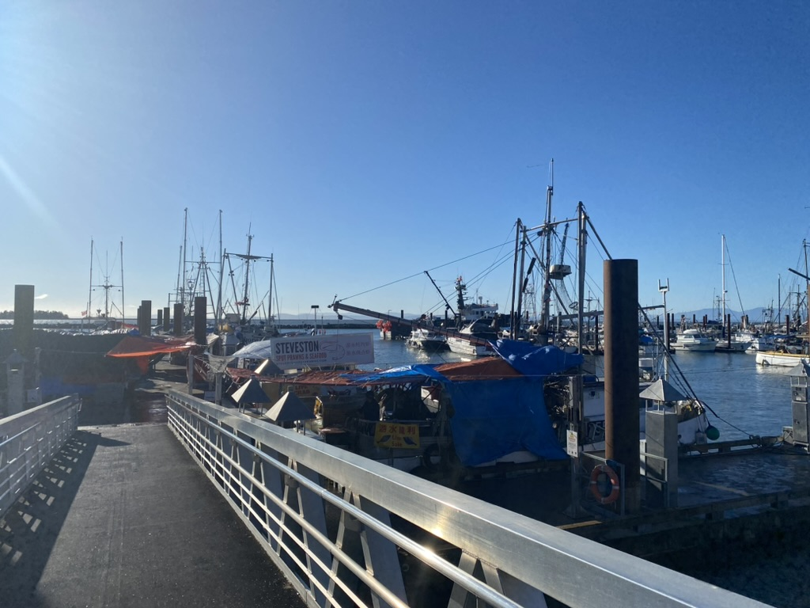
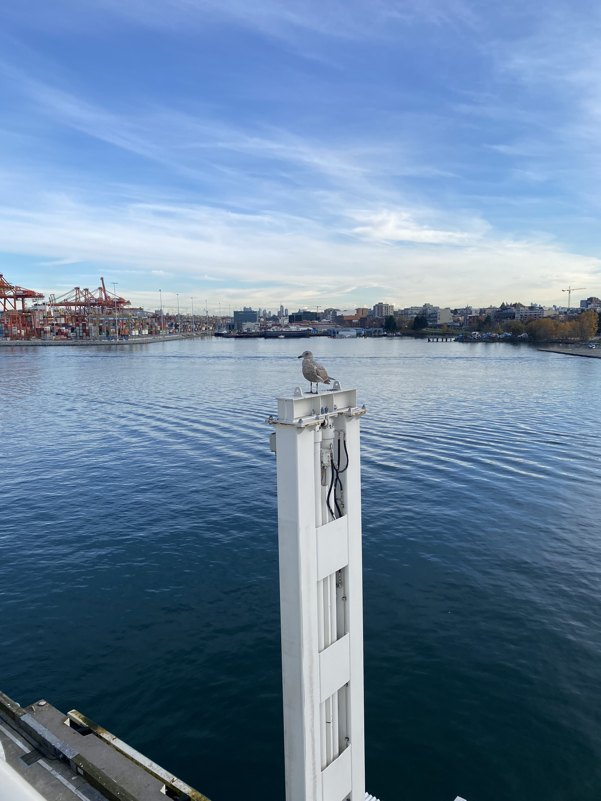

# Vancouver

🩵 *Special thanks to Yurou Wang (my cousin sister), Mark Guo and their families who gave me a wonderful trip here. I will never forget all delicious food and breathtaking views at Vancouver and certainly, just wait for me coming back!*

## Shots

\
↗️ The campus of The University of British Columbia, where my cousin sister graduated

\
↗️ The Lions Gate Bridge connecting Vancouver Downtown and North Vancouver

\
↗️ Looking toward Vancouver Downtown from the Stanley Park

\
↗️ Vancouver Public Library

\
↗️ The Fisherman's Wharf at Richmond's seaside

\
↗️ Never attempt to understand what a seabird is thinking about

### [🚢 Travel](./travel.md)