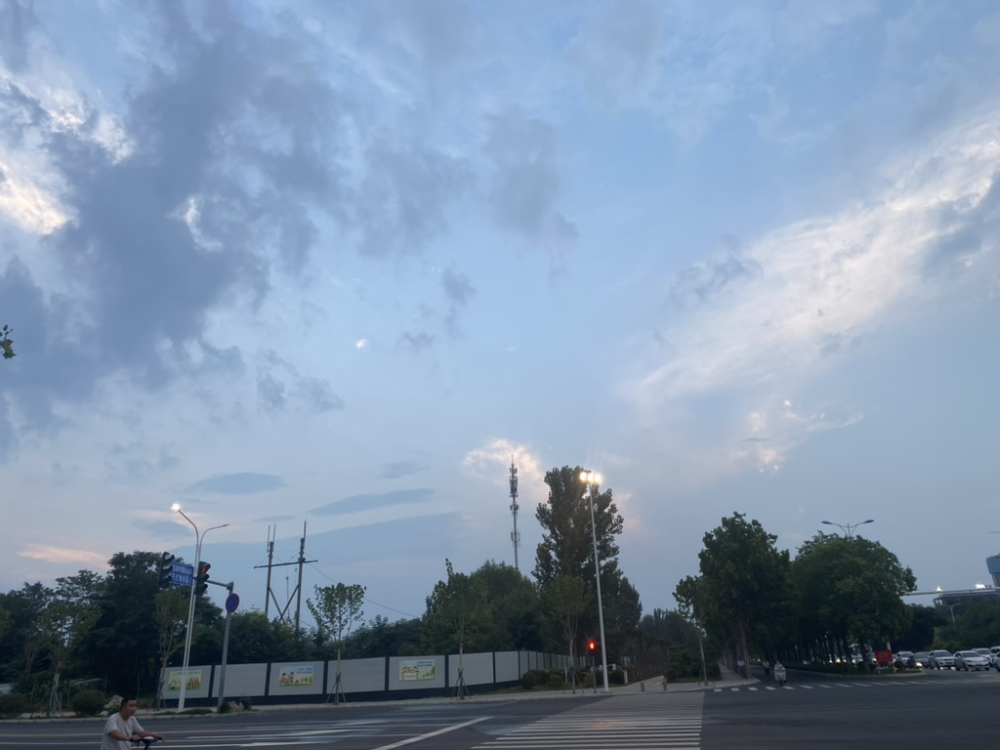
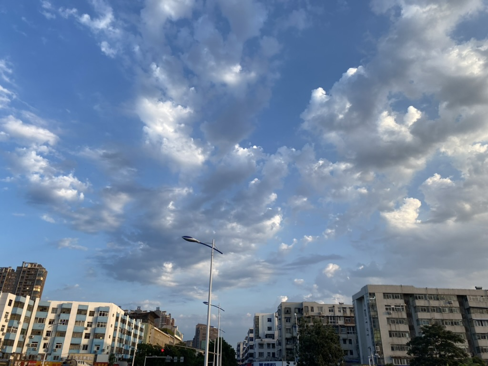
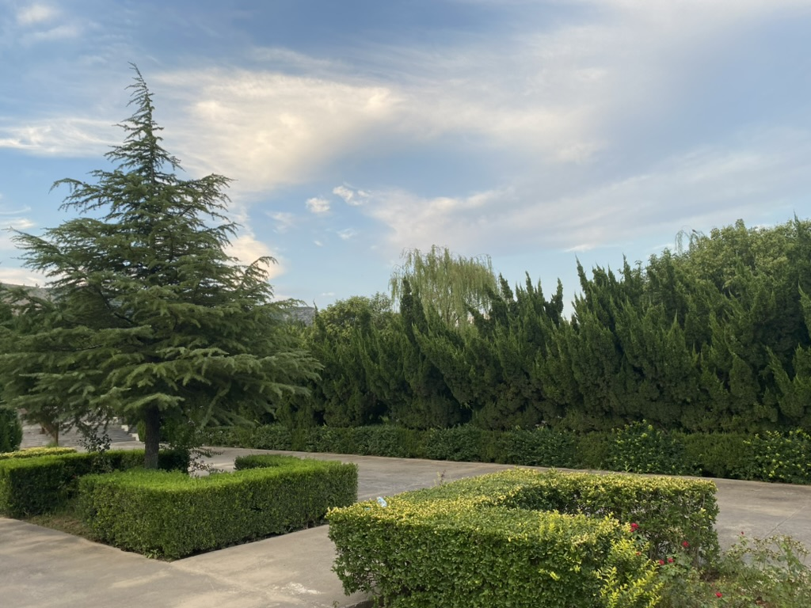

# Xinxiang 新乡

🩵 *这里是我的家乡。我在这里度过了人生的前十八年时光，感谢我在这里所有的家人和朋友给我带来的快乐与感动。感谢我的父母、老师、同学们，我希望这里一切的美好永远不变。*

## Shots

\
↗️ 新中大道和建设东路交叉口，我家附近的十字路口，某天傍晚的天空

\
↗️ 劳动路和中同街交叉口，这里距离我的小学很近，某天午后的天空

\
↗️ 微风吹过墓园，这里的人曾经也不在这里

### [🚢 Travel](./travel.md)