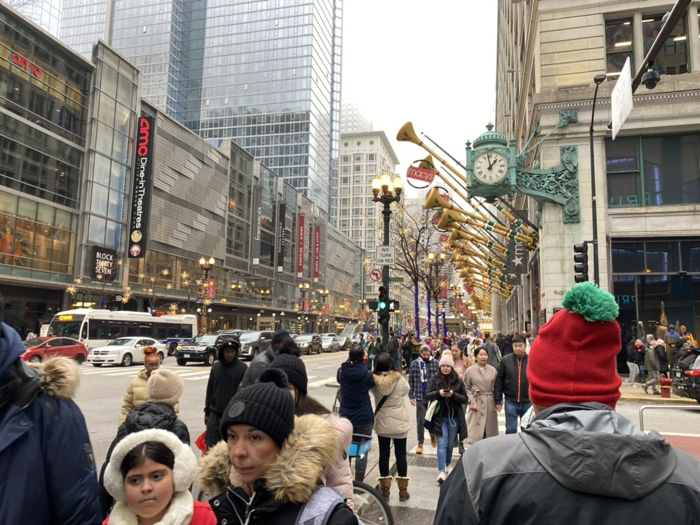
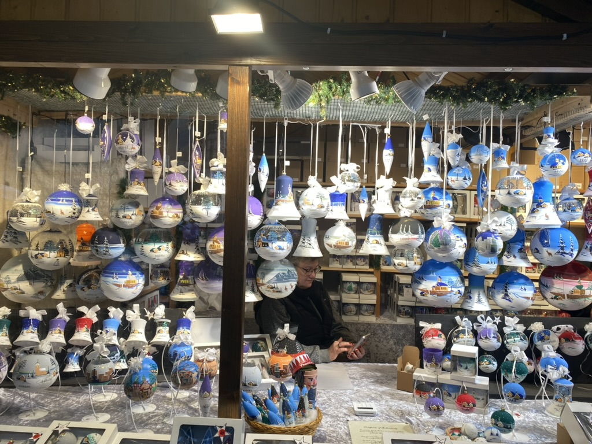
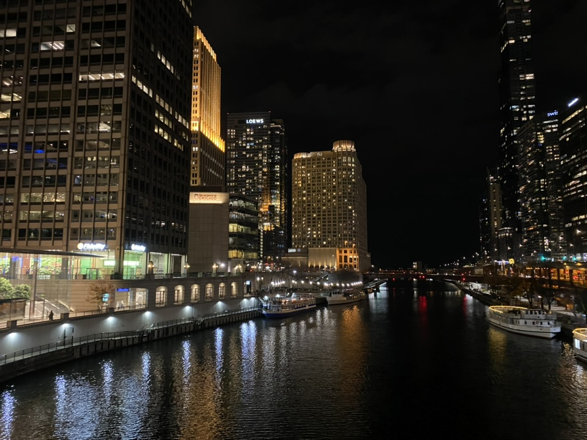
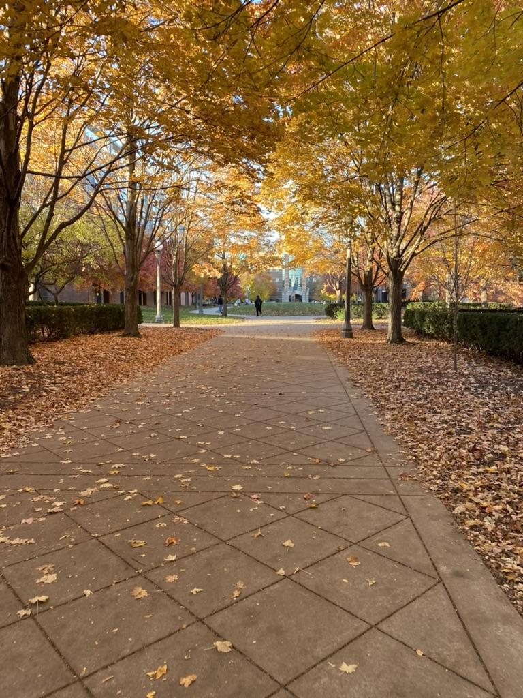
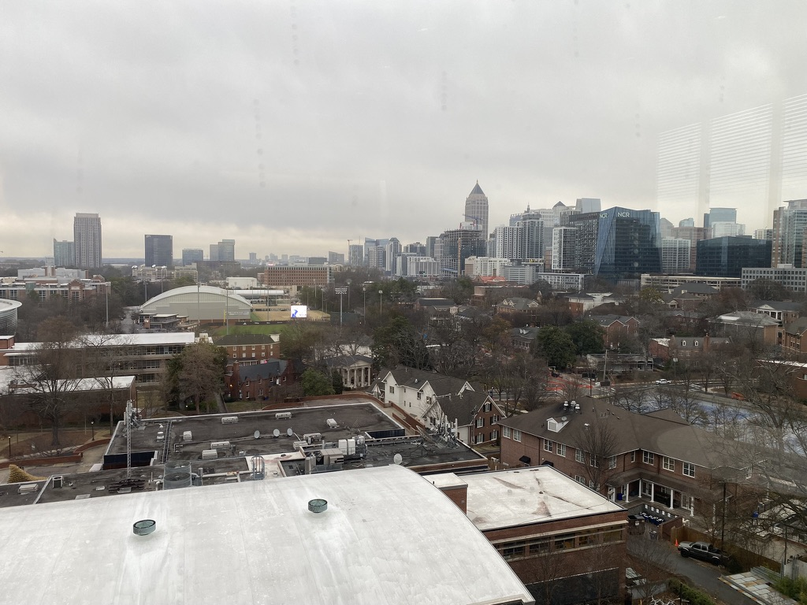
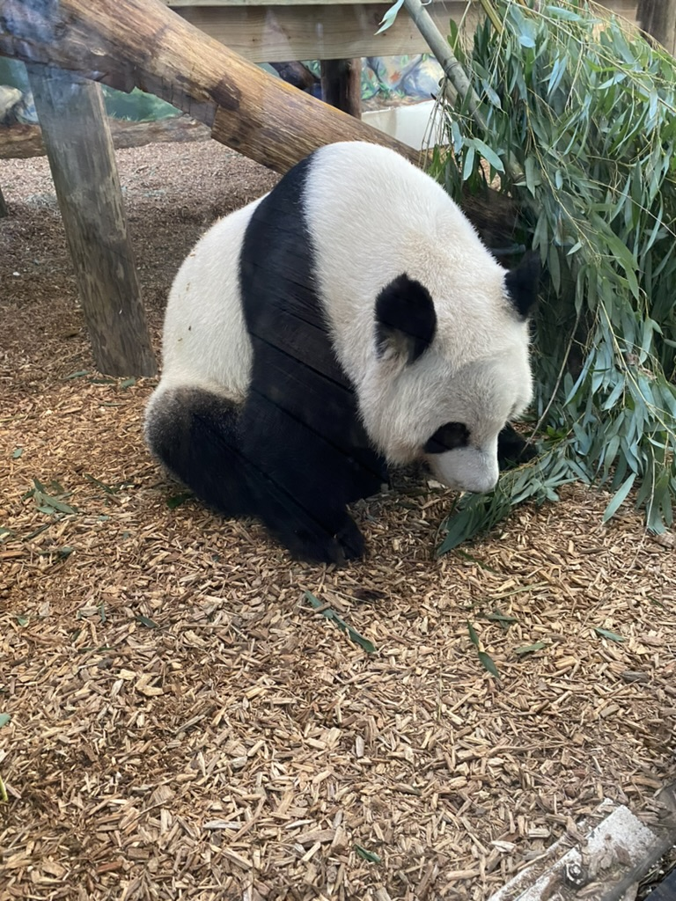
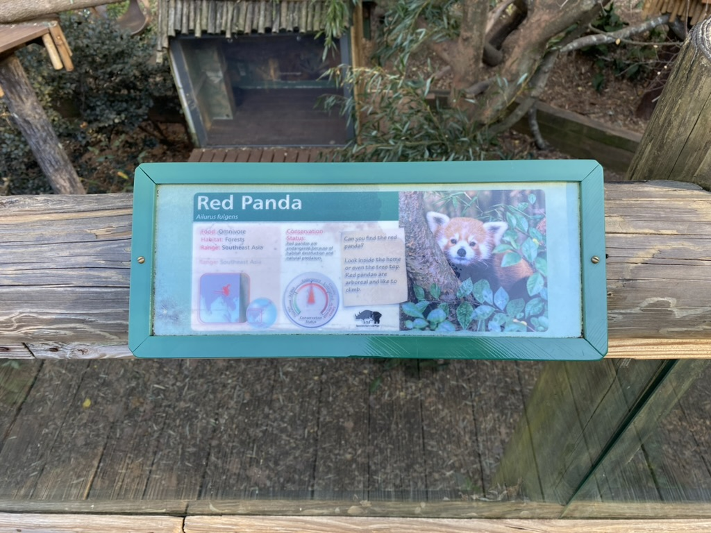

# Travel

## 🇨🇳 China

### Henan 河南

#### Xinxiang 新乡 🔴
#### Zhengzhou 郑州
#### Kaifeng 开封

### Beijing 北京

### Tianjin 天津

### Chongqing 重庆

### Shanghai 上海

### Sichuan 四川

#### Chengdu 成都
#### Ya'an 雅安

### Jiangsu 江苏

#### Nanjing 南京

### Zhejiang

#### Hangzhou 杭州
#### Shaoxing 绍兴

### Liaoning

#### Dalian 大连

### Shandong

#### Qinhuangdao 秦皇岛

### 🇭🇰 Hong Kong 香港

### 🇲🇴 Macau 澳门

## 🇺🇸 United States

### Illinois [IL]

#### Chicago

\
↗️ Chicago downtown seen from Navy Pier

\
↗️ Along Lake Michigan

\
↗️ The Rockefeller Memorial Chapel in University of Chicago

\
↗️ Macy's decoration during 2023 Christmas

\
↗️ Christmas market 2023 in Chicago

\
↗️ Chicago River around the Loop with shining buildings

\
↗️ Georges Seurat's *A Sunday Afternoon on the Island of La Grande Jatte* in the Art institute of Chicago

\
↗️ Gateway through Chicago Chinatown

#### Urbana-Champaign

\
↗️ Main Quad of UIUC, almost visually identical to Tsinghua University's

\
↗️ UIUC's autumn

\
↗️ The McFarland Memorial Bell Tower in UIUC

\
↗️ There are always snowy days in Urbana-Champaign's winter

\
↗️ Looking from the window of the Grainger Engineering Library

\
↗️ Do not miss the sky at dusk

### Georgia [GA]

#### Atlanta

\
↗️ Meet the history at the World of Coca-Cola in Atlanta

\
↗️ Looking down at the campus of Georgia Institute of Technology

\
↗️ Zoo Atlanta, the only site in US with giant pandas at the time of my visit

\
↗️ My life will be never complete without red pandas

<video width="400" controls>
  <source src="./img/Atlanta/redpanda_v.mp4" type="video/mp4">
</video>
↗️ The Angel is having dinner

### New York [NY]

#### New York City

\
↗️ Time Square is always crowded, even at midnight

## 🇨🇦 Canada

### British Columbia

#### Vancouver